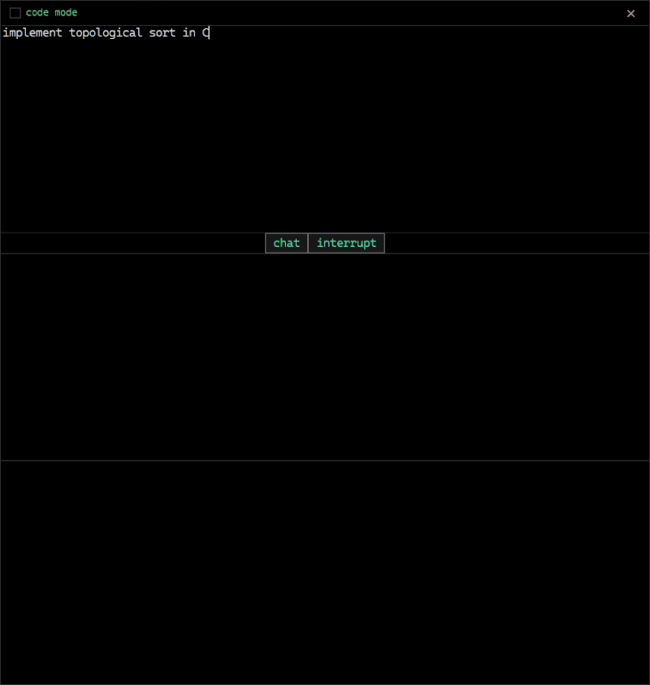
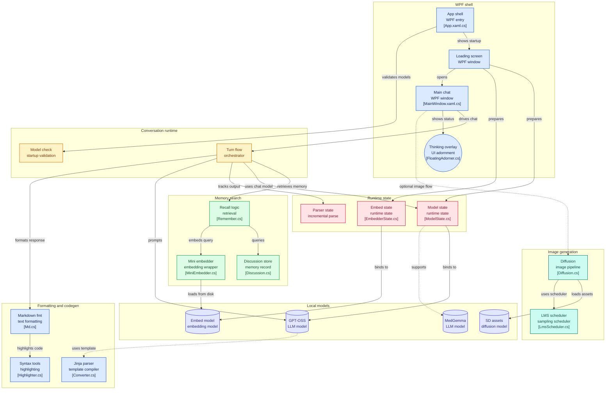

# OLLM
- **Completely local** LLM chat desktop application that uses the *ONNX Generative AI Runtime*. 
- **Does not make any networking requests outside of the local machine.**
- **Zero HTTP** *(e.g.: API calls to OpenAI, Gemini)*, 
- **Zero REST API middle-layer** *(e.g.: GPT4All)* 
- **Zero WebSocket middle-layer** *(Ollama, LM Studio, etc.)*.
- Loads a local LLM model. 
- The latest release utilizes **gpt-oss-20b**.



## Roadmap 
- **High Priority**
    1. Memory/conversation state management with retrieval augmentation and chat histories. **90% complete**
        - Initializes a local SQLite database if it does not exist.
  		- Utilize `VectorData` abstractions and connectors for SQLite.
      		- Microsoft is sort of developing solutions in parallel regarding native SQL Vector storage *(i.e.: `Microsoft.SemanticKernel.Connectors.SqliteVec` pre-release)*
      	-  Implemented two methods:
            1. `MemorizeDiscussion(...) // Store a discussion that had occurred.`
            2. `RememberDiscussions(...) // Try to remember before responding`
          - `VectorSearch` occurs with decay parameters like `halfLifeDays = 365, etc.`
          - **The goal is that they keep learning** and you **backup the local database yourself**. *(i.e.: the model lives in this one machine and learns forever.*)
        
- **Low Priority**
  - Other planned QOL improvements (low priority):
    - Image/vision -> embeddings -> retrieval augmentation. I don't want to fast-forward this with existing solutions.
    - Changing models via dropdown menu selection

### Setup
- Your directory setup should look something like the diagram below, although the `model.onnx` and `model.onnx_data` will be absent. This is due to size (gigabytes).
```
        ,______________________________________________________
        | OnnxLocalLLM\ONNX\gpt-oss-20b
        |
        | model.onnx        <------------------ Download this 
        | model.onnx_data   <------------------ Download this 
        |
        | genai_config.json
        | special_tokens_map.json
        | tokenizer_config.json
        | tokenizer.json
        | vocab.json
        |____________________________________________________
```
